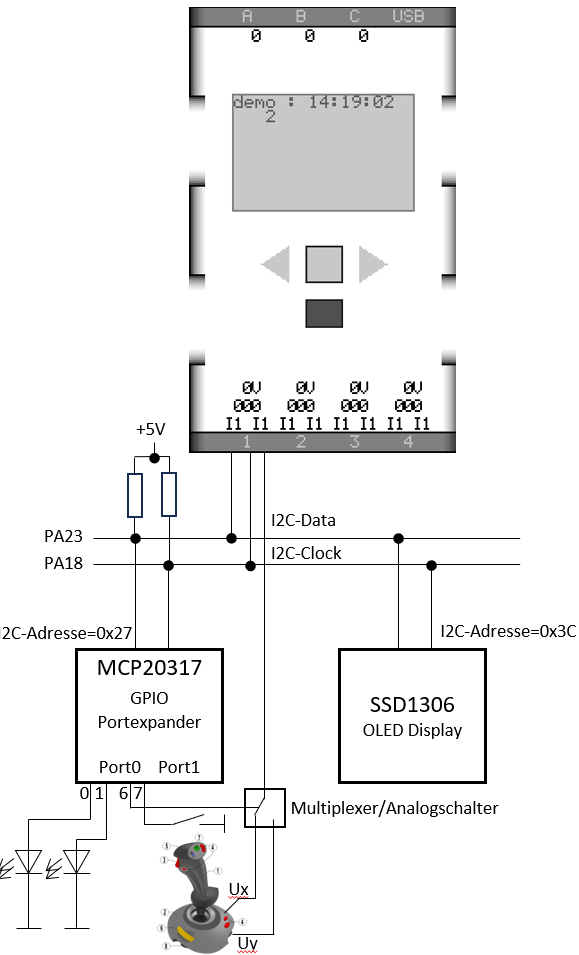

# Task

## Setup

- 
- PA23 => I2C Data
- PA18 => I2C Clock
- PA23 und PA18 sind über PullUp-Wiederstand auf +5v gezogen
- MCP20317(GPIO-Expander)
  - 2 Leds auf GPA0 und GPA1
  - Multiplexer-Leitung für Achse-x und Achse-y auf GPA06
  - GPA07 ist auf undefined (offener schalter nach Ground)

## TODO

- [ ] PIO-A referenzieren

```c
#define AT91C_BASE_PIOA      ((AT91PS_PIO)     0xFFFFF400) // (PIOA) Base Address

typedef struct _AT91S_PIO {
    AT91_REG     PIO_PER;     // PIO Enable Register
    AT91_REG     PIO_PDR;     // PIO Disable Register
    AT91_REG     PIO_PSR;     // PIO Status Register
    AT91_REG     Reserved0[1];     //
    AT91_REG     PIO_OER;     // Output Enable Register
    AT91_REG     PIO_ODR;     // Output Disable Registerr
    AT91_REG     PIO_OSR;     // Output Status Register
    AT91_REG     Reserved1[1];     //
    AT91_REG     PIO_IFER;     // Input Filter Enable Register
    AT91_REG     PIO_IFDR;     // Input Filter Disable Register
    AT91_REG     PIO_IFSR;     // Input Filter Status Register
    AT91_REG     Reserved2[1];     //
    AT91_REG     PIO_SODR;     // Set Output Data Register
    AT91_REG     PIO_CODR;     // Clear Output Data Register
    AT91_REG     PIO_ODSR;     // Output Data Status Register
    AT91_REG     PIO_PDSR;     // Pin Data Status Register
    AT91_REG     PIO_IER;     // Interrupt Enable Register
    AT91_REG     PIO_IDR;     // Interrupt Disable Register
    AT91_REG     PIO_IMR;     // Interrupt Mask Register
    AT91_REG     PIO_ISR;     // Interrupt Status Register
    AT91_REG     PIO_MDER;     // Multi-driver Enable Register
    AT91_REG     PIO_MDDR;     // Multi-driver Disable Register
    AT91_REG     PIO_MDSR;     // Multi-driver Status Register
    AT91_REG     Reserved3[1];     //
    AT91_REG     PIO_PPUDR;     // Pull-up Disable Register
    AT91_REG     PIO_PPUER;     // Pull-up Enable Register
    AT91_REG     PIO_PPUSR;     // Pull-up Status Register
    AT91_REG     Reserved4[1];     //
    AT91_REG     PIO_ASR;     // Select A Register
    AT91_REG     PIO_BSR;     // Select B Register
    AT91_REG     PIO_ABSR;     // AB Select Status Register
    AT91_REG     Reserved5[9];     //
    AT91_REG     PIO_OWER;     // Output Write Enable Register
    AT91_REG     PIO_OWDR;     // Output Write Disable Register
    AT91_REG     PIO_OWSR;     // Output Write Status Register
} AT91S_PIO, *AT91PS_PIO;
```

```c
#define P0_SDA 23 // Sensor-1 DIGx0  PA23=SCK1/PWM0
#define P0_SCL 18 // Sensor-1 DIGx1  PA18=RD  /PCK2/AD1
AT91PS_PIO pio_a = AT91C_BASE_PIOA;

```

- [ ] Die PullUp Widerstände für den I2C-Bus sind auf der Platine vorhanden, so dass der GPIO-Internen PullUp Widerstände zu deaktivieren sind
  - [ ] PA18 und PA23 auf 1 im Pull Up Disable Register

  ```c
  pio_a->PIO_PPUDR = (1 << P0_SCL) | (1 << P0_SDA);

  ```

- [ ]Zur Konfiguration der GPIO-Leitungen als OpenCollector sind die beiden rechten Multiplexer auf 1 (MDER) zu schalten.
  
  - [ ] Enable Multi-drive

```c
  pio_a->PIO_MDER = (1 << P0_SCL) | (1 << P0_SDA);
```

- Wenn über SODR eine 1 ausgegeben wird, wird über den oberen Multiplexer der Ausgangstreiber deaktiviert.
  

```c
  pio_a->PIO_SODR = (1 << P0_SCL) | (1 << P0_SDA);
```

- Wenn über CODR eine 0 ausgegeben wird, so wird über den oberen Multiplexer der Ausgangstreiber aktiviert und über den unteren Multiplexer eine 0 ausgegeben
  

```c
  pio_a->PIO_CODR = (1 << P0_SCL) | (1 << P0_SDA);
```

- [ ] Vervollständigen Sie den im der main.c-Datei vorhandenen I2C-Treiber (Quelle: Alten Wikipedia Artikel über I2C)

void I2C_delay(void);
bool read_SCL(void); // Return current level of SCL line, 0 or 1
bool read_SDA(void); // Return current level of SDA line, 0 or 1
void set_SCL(void); // Do not drive SCL (set pin high-impedance)
void clear_SCL(void); // Actively drive SCL signal low
void set_SDA(void); // Do not drive SDA (set pin high-impedance)
void clear_SDA(void); // Actively drive SDA signal low

- [ ] Steuern sie den GPIO-Expander wie folgt an
  - [ ] Eine LED blinken lassen (1xAn/Aus je Sekunde)
  - [ ] Andere LED zeigt den Status der Joystick-Taste an
- [ ] Erzeugen sie eine Bildschirmkopie des Fenster 'v.draw %e ...' mit einem I2C-Schreib-oder Lesezugriffes auf den GPIO-Exapander und kommentieren sie diese zeichnerisch in der Grafik!
